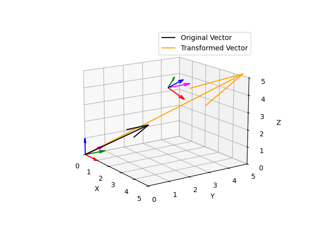
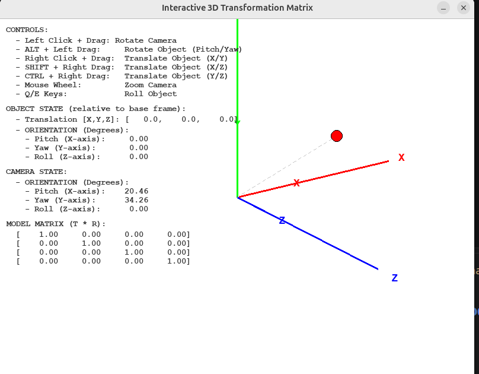
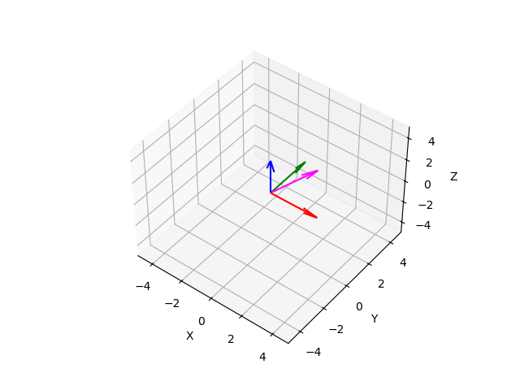

# Axis Transformation Module

This module provides tools and visualizations for understanding coordinate frame transformations, including 2D and 3D rotation matrices, translation operations, and homogeneous transformations commonly used in robotics.

## Overview

The module contains four main Python scripts demonstrating different aspects of coordinate transformations:

1. **2d_t_matrix.py** - Interactive 2D transformation matrix visualization
2. **3D_transform_visualization.py** - Interactive 3D frame transformation with mouse/keyboard control
3. **axis_frames.py** - Static 3D coordinate frame visualization
4. **rotation_axis.py** - 3D rotation functions and homogeneous transformations

## Dependencies

Before running any scripts, ensure you have the required packages installed:

```bash
pip install pygame numpy matplotlib
```

### Package Details
- **pygame** - Graphics and interactive visualization
- **numpy** - Matrix and vector operations
- **matplotlib** - Static 3D plotting and visualization

## Installation

1. Navigate to the axis_transformation directory:
```bash
cd axis_transformation
```

2. Install dependencies:
```bash
pip install -r requirements.txt
```

Or install manually:
```bash
pip install pygame numpy matplotlib
```

## Script Descriptions and Usage

### 1. 2D Transformation Matrix Visualization (`2d_t_matrix.py`)

**Purpose:** Demonstrates 2D homogeneous transformation matrices combining rotation and translation.

**Features:**
- Animated transformation of a point between two coordinate frames
- Real-time display of rotation angle and translation values
- Shows Frame {A} (static reference) and Frame {B} (moving frame)
- Visualizes how a point defined in Frame {B} transforms to Frame {A}

**Execution:**
```bash
python 2d_t_matrix.py
```

**Output:**
- A pygame window showing an animated coordinate transformation
- Red point showing the transformed position
- Blue frame showing the moving reference frame
- Real-time values of rotation and translation

**Keyboard:**
- Close the window to exit

---

### 2. 3D Transform Visualization (`3D_transform_visualization.py`)

**Purpose:** Interactive 3D visualization of coordinate frame transformations with real-time control.

**Features:**
- Full 3D transformation visualization with perspective projection
- Mouse control for real-time rotation (drag to rotate)
- Keyboard controls for precise rotation and translation
- Multiple reference frames and coordinate axes visualization
- Zoom and pan capabilities

**Execution:**
```bash
python 3D_transform_visualization.py
```

**Controls:**
- **Mouse Click & Drag:** Rotate the view around X and Y axes
- **Arrow Keys:** 
  - Left/Right: Rotate around Z-axis
  - Up/Down: Rotate around X-axis
- **W/A/S/D:** Translate along X and Y axes
- **Q/E:** Translate along Z-axis
- **+/-:** Zoom in and out
- **ESC or Window Close:** Exit the application

**Output:**
- Interactive 3D window with rotating frames and axes
- Real-time coordinate frame visualization
- Visual feedback on transformations

---

### 3. 3D Coordinate Frame Visualization (`axis_frames.py`)

**Purpose:** Static visualization of 3D coordinate frames and axes using matplotlib.

**Features:**
- Displays 3D coordinate frames with X, Y, Z, and P axes
- Uses matplotlib's 3D projection
- Customizable frame positions

**Execution:**
```bash
python axis_frames.py
```

**Output:**
- A matplotlib window displaying:
  - X-axis (Red)
  - Y-axis (Green)
  - Z-axis (Blue)
  - P-axis (Magenta) - diagonal axis
- Adjustable viewing angles using matplotlib's built-in tools

**Notes:**
- The script includes example code showing how to draw axes at different positions
- Uncomment the commented `draw_axes()` line to visualize multiple frames

---

### 4. 3D Rotation Functions (`rotation_axis.py`)

**Purpose:** Provides utility functions for performing 3D rotations and homogeneous transformations.

**Features:**
- `rotate_x()` - Rotate vectors about the X-axis
- `rotate_y()` - Rotate vectors about the Y-axis
- `rotate_z()` - Rotate vectors about the Z-axis
- `homogeneous_transform()` - Combined rotation and translation transformation

**Usage as a Module:**
```python
import rotation_axis as rot
import numpy as np

# Define vectors
x_axis = np.array([1, 0, 0])
y_axis = np.array([0, 1, 0])
z_axis = np.array([0, 0, 1])
p_axis = np.array([1, 1, 1])

# Rotate 45 degrees about Z-axis
x_rot, y_rot, z_rot, p_rot = rot.rotate_z(x_axis, y_axis, z_axis, p_axis, 45)

# Apply homogeneous transformation
# Rotation: 30° about X, 45° about Y, 60° about Z
# Translation: (1, 2, 3)
transformed_vector, tx, ty, tz, tp = rot.homogeneous_transform(
    p_axis, x_axis, y_axis, z_axis, p_axis,
    theta_deg=30, phi_deg=45, psi_deg=60,
    px=1, py=2, pz=3
)
```

**Running as a Script:**
```bash
python rotation_axis.py
```

---

## Quick Start Examples

### Example 1: Run 2D Transformation Animation
```bash
python 2d_t_matrix.py
```
Watch the point move as the frame rotates and translates.

### Example 2: Explore 3D Transformations Interactively
```bash
python 3D_transform_visualization.py
```
Use your mouse and keyboard to manipulate the 3D frames.

### Example 3: View Static 3D Axes
```bash
python axis_frames.py
```
Close the plot window to exit.

## Mathematical Concepts

### 2D Homogeneous Transformation Matrix
```
T = [cos(θ)  -sin(θ)  tx]
    [sin(θ)   cos(θ)  ty]
    [  0        0      1]
```
Where θ is rotation angle and (tx, ty) is translation.

### 3D Homogeneous Transformation Matrix
```
T = [R  | t]
    [---|--]
    [0  | 1]
```
Where R is the 3×3 rotation matrix and t is the 3×1 translation vector.

### Frame Transformation
To transform a point P from Frame {B} to Frame {A}:
```
P_A = T_{B→A} × P_B
```

## Troubleshooting

### pygame ImportError
```
ModuleNotFoundError: No module named 'pygame'
```
**Solution:** Install pygame
```bash
pip install pygame
```

### No display available (Running on Linux without GUI)
If running on a server without a display:
```bash
export DISPLAY=:0  # Adjust display number as needed
python script_name.py
```

### matplotlib not showing
If plots don't appear:
```python
# Add at the end of scripts using matplotlib
import matplotlib.pyplot as plt
plt.show()
```

## File Structure

```
axis_transformation/
├── 2d_t_matrix.py                    # 2D transformation animation
├── 3D_transform_visualization.py     # Interactive 3D visualization
├── axis_frames.py                    # Static 3D axis visualization
├── rotation_axis.py                  # Rotation utility functions
└── README.md                         # This file
```

## Applications

These scripts are useful for:
- Learning coordinate transformations in robotics
- Visualizing forward and inverse kinematics
- Understanding rotation matrices and Euler angles
- Debugging coordinate frame relationships
- Teaching robotics fundamentals

## Further Learning

- Research papers on homogeneous transformations in robotics
- Study the Denavit-Hartenberg (DH) convention for robot kinematics
- Explore quaternion-based rotations for advanced applications
- Integrate with robot simulation frameworks like ROS or CoppeliaSim

## License

These scripts are part of the robotics_code project.

## Author Notes

These visualizations help build intuition about:
- How coordinate frames relate in 2D and 3D space
- How rotation matrices work geometrically
- How translation and rotation combine in homogeneous transformations
- Real-time effects of transforming coordinate frames


## Images
* Visualizing Tranformation (rotation + translation)


* Interactive GUI for understanding rotation


* Visualizing Axis Frames



