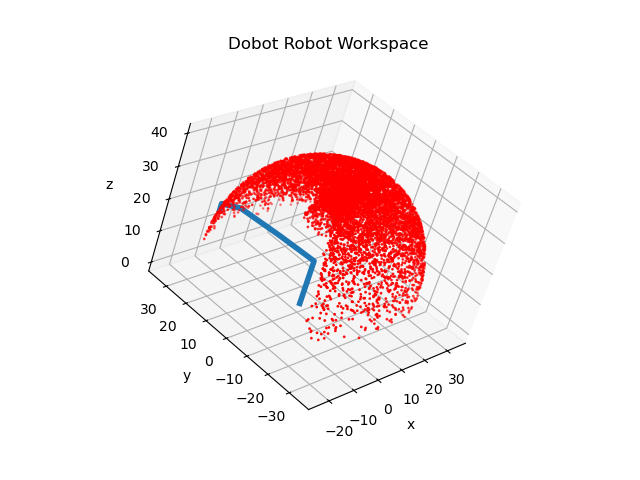
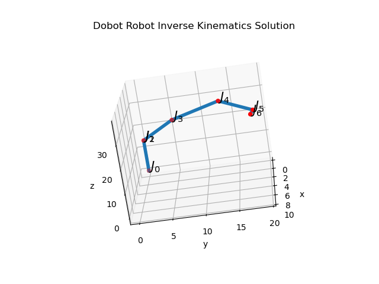
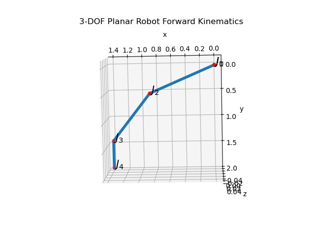
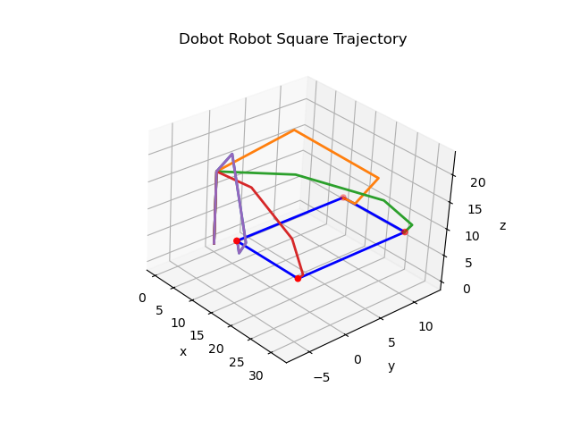
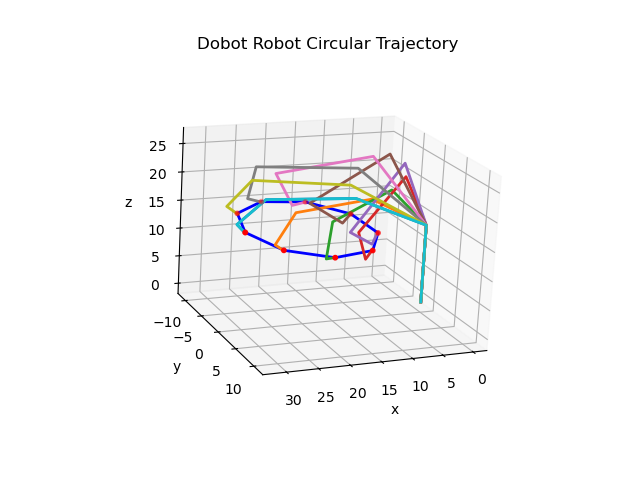

# Forward and Inverse Kinematics from D-H Parameters
Currently, we are using JJ Craig's convention for deriving DH Parameters

## Dependencies
* Python 3.x
* symbolic toolbox sympy
* numpy
* scipy
* matplotlib


## Files

- `fwd_kinematics_dhp.py`: Provides functions to solve the forward kinematics from DH parameters
- `fk_example_3R.py`: Demonstrates the usage of forward kinematic functions to visualize the robot model.
- `dobot_4dof_fk.py`: Solves the forward kinematics for 4DOF Dobot magician robot
- `inverse_kinematics_dhp.py`: Provides functions to solve the inverse kinematics from DH parameters.
- `dobot_4dof_ik.py`: Solves the inverse kinematics for 4DOF Dobot magician robot
- `dobot_config.py`: Contains dobot magician specific parameters, e.g., DH parameters, joint limits etc.

## How to use
You can simply run each file through command line:
```bash
python fk_example_3R.py
python dobot_4dof_fk.py
python dobot_4dof_ik.py
```

## Pseudoinverse method for computing Inverse Kinematics

Forward kinematic equation is given by:

$$\mathbf{x} = f(\mathbf{q})$$

Differentiating both sides with respect to time, we get:

$$\begin{align}
\dot{\mathbf{x}} &= f'(\mathbf{q})\dot{\mathbf{q}} = J \dot{\mathbf{q}} \\
\Rightarrow \dot{\mathbf{q}} &= J^{\dagger} \dot{\mathbf{x}}
\end{align}$$

Where $J = \frac{d\mathbf{x}}{d\mathbf{q}}$ is the Jacobian matrix and $J^{\dagger}$ is the Moore-Penrose pseudoinverse of $J$, such that $J^{\dagger} J = I$.

In terms of end effector position error, we can write as follows:

$$\begin{align}
\mathbf{e} &= \mathbf{x}_d - \mathbf{x}\\
\dot{\mathbf{e}} &= -\dot{\mathbf{x}} = -J\dot{\mathbf{q}}
\end{align}$$

By selecting $\dot{\mathbf{q}} = KJ^{\dagger} \mathbf{e}$, we get a stable system as:

$$\dot{\mathbf{e}} + K \mathbf{e} = 0$$

leading to $\mathbf{e} \rightarrow 0$ as $t \rightarrow \infty$.

This is because:

$$\dot{\mathbf{e}} = -K\mathbf{e} \Rightarrow \frac{d\mathbf{e}}{\mathbf{e}} = -Kdt$$

Integrating both sides:

$$\begin{align}
\int_0^t \frac{d\mathbf{e}}{\mathbf{e}} &= -K\int_0^t dt \\
\ln \mathbf{e}\Big|_{e_0}^e &= -Kt \\
\Rightarrow \mathbf{e} &= \mathbf{e}_0 e^{-Kt}
\end{align}$$

So, as $t \rightarrow \infty$, $\mathbf{e} \rightarrow 0$ for all $K > 0$. 

Hence, by starting with an initial value of $\mathbf{q}(t=0) = \mathbf{q}_0$, we can incrementally update the joint angles by using the following equation:

$$\mathbf{q} = \mathbf{q} + \dot{\mathbf{q}} \Delta t$$

where $\dot{\mathbf{q}} = KJ^{\dagger} (\mathbf{x}_d - \mathbf{x})$. 

The iteration loop is stopped when the two consecutive values of the joint angle vectors are very close to each other.

## images

Dobot Workspace


Dobot model



3R Planar Robot model


IK solution for square trajectory


IK Solution for circle trajectory




