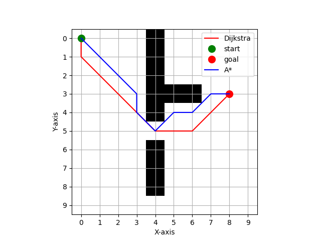
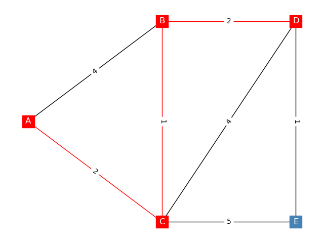
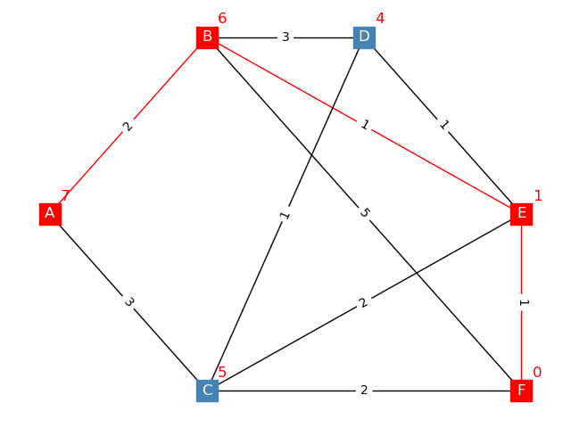

# Path Planning algorithms

## Dijkstra Algorithm
It has three variants
- `dijkstra_dict.py`: takes input graph as a dictionary
- `dijkstra_graph.py`: takes input graph as a class 
- `dijkstra_grid.py`: takes graph as a numpy array grid

## A* Algorithm
It also has three variants
- `a_star_dict.py`: takes input graph as a dictionary
- `a_star_graph.py`: takes input graph as a class 
- `a_star_grid.py`: takes graph as a numpy array grid

## Graph Visualization
- It contains all functions to visualize the graph or the grid

## Images

### comparison between Dijkstra and A* Algorithm

### Dijkstra for graph

### A* for graph

